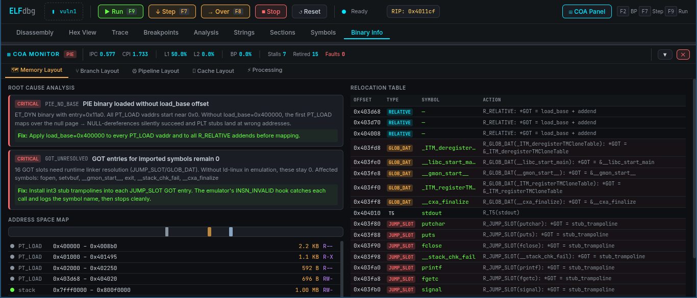

<div align="center">

# ELFdbg

**Browser-based ELF binary emulator and reverse engineering debugger**

[](https://python.org)
[](https://flask.palletsprojects.com)
[](https://www.unicorn-engine.org)
[](https://www.capstone-engine.org)
[](LICENSE)

[Features](#features) · [Screenshots](#screenshots) · [Quick Start](#quick-start) · [Architecture](#architecture) · [API Reference](#api-reference) · [COA Panel](#coa-monitor-panel)

</div>

---

## Overview

ELFdbg is a **zero-install web debugger** for x86-64 and ARM64 ELF binaries. Drop a binary in the browser and get a full GDB/WinDbg-style debugging experience — disassembly, live registers, hex viewer, breakpoints, execution trace, and a unique **COA (Class-of-Architecture) Monitor** that visualises the CPU pipeline, cache hierarchy, branch predictor, and memory layout in real time.

Both **static** and **dynamically linked / PIE** binaries are supported. Dynamic imports (`printf`, `malloc`, etc.) are intercepted via GOT stubs and return safely without crashing.

---

## Screenshots

### Main Debugger — Disassembly + Registers


```
┌──────────────────────────────────────────────────────────────────────┐
│  ELFdbg  [loops_x64]  ▶ Run  ↓ Step  → Over  ■ Stop  ↺ Reset       │
│  ● Ready   RIP: 0x00401740                          ⊞ COA Panel     │
├───────────┬──────────────────────────────────────┬───────────────────┤
│ Registers │ Disassembly                          │ Call Stack        │
│           │                                      │                   │
│ rax 0x0   │ ● 0x401740  endbr64                 │ #0  0x401785      │
│ rbx 0x0   │   0x401744  xor    ebp, ebp          │ #1  0x401819      │
│ rcx 0x0   │   0x401746  mov    r9, rdx           │                   │
│ rdx 0x0   │ → 0x401749  pop    rsi               │ Memory Map        │
│ rsp 0x7f▸ │   0x40174a  mov    rdx, rsp          │                   │
│ rbp 0x7f▸ │   0x40174d  and    rsp, -0x10        │ stack  0x7fff0000 │
│ rip 0x401 │   0x401751  push   rax               │ heap   0x1000000  │
│           │   0x401752  push   rsp               │ text   0x401000   │
├───────────┴──────────────────────────────────────┴───────────────────┤
│ Stack                                                                  │
│ RSP  0x800efdc0  →  0x0000000000000001                               │
│ +8   0x800efdc8  →  0x800efdf0  "binary"                             │
└──────────────────────────────────────────────────────────────────────┘
```

### COA Monitor — Pipeline Waterfall + Cache Hierarchy


---

## Features

### Debugger
| Feature | Details |
|---|---|
| **Disassembly** | Capstone-powered x86-64 / ARM64 with byte listing, branch target annotations, symbol overlay |
| **Live registers** | All GPRs with change highlighting (orange flash on write); click any register to edit inline |
| **Hex viewer** | Live memory dump with ASCII panel; click any row in the disassembler to jump there |
| **Stack viewer** | RSP-relative dump with symbol resolution; click any value to disassemble at that address |
| **Breakpoints** | Exec / Read / Write / Access; conditional expressions (`rax == 0`, `rbx > 0x100`); hit counters |
| **Execution trace** | Full history — address, mnemonic, operands, memory R/W, syscall details, symbol label |
| **Sections viewer** | Visual bar chart of all ELF sections sized proportionally; click to disassemble |
| **Symbol table** | All exports, imports, and debug symbols; click to navigate disassembly |
| **Static strings** | Auto-extracted from `.rodata` / `.data` / `.text`; click to view in hex |
| **Runtime strings** | ASCII bytes written to memory during execution |
| **Syscall tracer** | Name-resolved syscall log with all six arguments |
| **Call stack** | Reconstructed call chain from branch trace |

### COA (Class-of-Architecture) Monitor

Five live subsystem panels powered by the execution trace:

| Panel | What it shows |
|---|---|
| **Memory Layout** | Full virtual address-space map, RWX region warnings, relocation table, unmapped-access log, root-cause analysis for dynamic linking failures |
| **Branch Layout** | 2-bit saturating counter predictor; taken/not-taken timeline dots; hot-spot table with predictor state pips; mispredict rate |
| **Pipeline Layout** | 5-stage (Fetch → Decode → Execute → Memory → WriteBack) utilisation gauges; waterfall grid for last 8 instructions; IPC, CPI, stall/flush counts |
| **Cache Layout** | L1i / L1d / L2 / L3 LRU simulation (Skylake parameters); hit-rate bars; access-level distribution; live access log |
| **Processing** | Throughput sparkline per run segment; stall rate; fault/exception event log; dynamic binary loader control |

### Dynamic Binary Support

ELFdbg fully handles dynamically linked and PIE binaries:

- Detects `ET_DYN` / dynamic section automatically on upload
- Applies `load_base = 0x400000` to all `PT_LOAD` segments
- Patches `R_X86_64_RELATIVE` GOT entries at load time
- Installs `xor rax,rax; ret` stub trampolines for every `JUMP_SLOT` / `GLOB_DAT` entry  
  → PLT calls to `printf`, `malloc`, `free`, etc. **return 0 and continue** instead of crashing
- Logs every intercepted PLT call with its six register arguments

### Keyboard Shortcuts

| Key | Action |
|---|---|
| `F7` / `s` | Step into (1 instruction) |
| `F8` / `n` | Step over |
| `F9` / `r` | Run to breakpoint or timeout |
| `F2` | Toggle breakpoint at current RIP |
| Double-click | Toggle breakpoint on instruction row |
| Right-click | Context menu (set RIP, hex view, disassemble here) |

---

## Quick Start

### Requirements

- Python 3.10 or newer
- Linux / macOS (Windows WSL2 works fine)

### Install

```bash
git clone https://github.com/yourname/elfdbg
cd elfdbg
pip install -r requirements.txt
```

`requirements.txt`:
```
unicorn>=2.0.1
capstone>=5.0.1
pyelftools>=0.31
flask>=3.0.0
flask-cors>=4.0.0
```

### Run

```bash
python app.py
```

Open **http://localhost:5000** in your browser.

### Load a binary

1. Click **"Drop ELF binary…"** in the toolbar (or drag-and-drop)
2. Select any x86-64 or ARM64 ELF — static or dynamically linked
3. The disassembly jumps to the entry point automatically
4. Press **F7** to step, **F9** to run, **F2** to set a breakpoint

### Test binaries

Two pre-compiled x86-64 ELF files are included in `examples/`:

```bash
examples/hello_x64    # static: strings, sub-function calls
examples/loops_x64    # static: arrays, fibonacci, memcpy
examples/dyn_test     # dynamic: malloc/printf/free (PIE)
examples/pie_test     # PIE: demonstrates GOT stub interception
```

Compile your own:

```bash
# Static (recommended for full emulation)
gcc -O0 -static -no-pie -o my_binary my_program.c

# Dynamic (PLT calls intercepted and stubbed)
gcc -O0 -o my_binary my_program.c
```

---

## Architecture

```
elfdbg/
│
├── app.py            Flask REST API — 38 endpoints, session state, COA wiring
├── emulator.py       Unicorn Engine wrapper
│                       • ELF memory mapping with page alignment
│                       • Code / mem-read / mem-write / unmapped hooks
│                       • PLT stub interception (xor rax,rax; ret)
│                       • Faulted-state detection and guard
│                       • Breakpoint / watchpoint engine
│                       • Execution trace + syscall log
│
├── analyzer.py       ELF parser + Capstone disassembler
│                       • Auto-detects static vs dynamic binary
│                       • load_dynamic_into_emulator():
│                           – load_base offset for PIE
│                           – R_RELATIVE fixups
│                           – JUMP_SLOT / GLOB_DAT stubs
│                       • Section, segment, symbol, relocation parsing
│                       • Function prologue detection
│                       • Static string extraction
│
├── coa_monitor.py    COA subsystem monitors
│                       • MemoryLayoutMonitor  (regions, conflicts, RCA)
│                       • BranchLayoutMonitor  (2-bit predictor)
│                       • PipelineLayoutMonitor (5-stage, IPC, stalls)
│                       • CacheLayoutMonitor   (L1/L2/L3 LRU)
│                       • ProcessingMonitor    (throughput, segments)
│
├── static/
│   ├── css/style.css  Dark terminal theme (JetBrains Mono)
│   ├── css/coa.css    COA panel styles
│   ├── js/ui.js       Main debugger UI (upload, disasm, regs, trace…)
│   └── js/coa.js      COA panel rendering (5 sub-panels)
│
├── templates/
│   └── index.html     Single-page app shell
│
├── examples/
│   ├── hello.c / hello_x64    Static hello-world
│   ├── loops.c / loops_x64    Static loop/array benchmark
│   ├── dyn_test               Dynamic binary (PIE)
│   └── pie_test               PIE binary
│
└── requirements.txt
```

### Data flow

```
Browser                    Flask (app.py)              Unicorn Engine
  │                              │                           │
  │  POST /api/upload            │                           │
  ├─────────────────────────────►│  ELFAnalyzer.parse()      │
  │                              │  load_into_emulator()─────►  map segments
  │                              │  COAMonitor.load_binary() │  install hooks
  │  GET  /api/disasm            │                           │
  ├─────────────────────────────►│  Capstone.disassemble()   │
  │◄─────────────────────────────┤                           │
  │                              │                           │
  │  POST /api/emulate/step      │                           │
  ├─────────────────────────────►│  emulator.step(n)─────────► _on_insn hook
  │                              │                           │  _on_mem_read
  │                              │  coa.update_from_emu()    │  _on_mem_write
  │◄─────────────────────────────┤                           │
  │  {ip, registers, faulted,    │                           │
  │   plt_calls, trace_len}      │                           │
```

---

## API Reference

All endpoints return JSON. Base URL: `http://localhost:5000`

### Binary

| Method | Endpoint | Description |
|--------|----------|-------------|
| `POST` | `/api/upload` | Upload ELF (multipart `file` field). Auto-detects static vs dynamic. |
| `POST` | `/api/upload/dynamic` | Force dynamic loader (applies load_base, stubs GOT) |
| `GET`  | `/api/info` | Binary metadata summary |
| `GET`  | `/api/sections` | ELF section list |
| `GET`  | `/api/segments` | ELF program headers |
| `GET`  | `/api/symbols` | Symbol table (exports, imports, all) |
| `GET`  | `/api/strings` | Static strings |
| `GET`  | `/api/relocations` | Relocation entries |
| `GET`  | `/api/functions` | Detected function entry points |

### Emulation

| Method | Endpoint | Body / Params | Description |
|--------|----------|---------------|-------------|
| `POST` | `/api/emulate/start` | `{begin, until, timeout, count}` | Run emulation |
| `POST` | `/api/emulate/step` | `{count}` | Step N instructions |
| `POST` | `/api/emulate/stop` | — | Stop execution |
| `POST` | `/api/emulate/reset` | — | Fresh reload from binary |
| `GET`  | `/api/state` | — | `{ip, registers, faulted, trace_len}` |

### Inspection

| Method | Endpoint | Description |
|--------|----------|-------------|
| `GET`  | `/api/registers` | All register values |
| `POST` | `/api/registers` | Write `{name, value}` |
| `GET`  | `/api/memory?addr=0x…&size=256` | Hex dump (rows with ASCII) |
| `POST` | `/api/memory` | Write `{addr, data}` (hex string) |
| `GET`  | `/api/stack?depth=24` | Stack frame dump |
| `GET`  | `/api/disasm?addr=0x…&size=512` | Disassemble range |
| `GET`  | `/api/callstack` | Reconstructed call chain |
| `GET`  | `/api/regions` | Mapped memory regions |

### Breakpoints

| Method | Endpoint | Description |
|--------|----------|-------------|
| `GET`  | `/api/breakpoints` | List all breakpoints |
| `POST` | `/api/breakpoints` | Add `{addr, type, condition}` |
| `DELETE` | `/api/breakpoints/<addr>` | Remove breakpoint |
| `PUT`  | `/api/breakpoints/<addr>` | Toggle enabled/disabled |

### Trace & Analysis

| Method | Endpoint | Description |
|--------|----------|-------------|
| `GET`  | `/api/trace?start=0&limit=200` | Paginated execution trace |
| `GET`  | `/api/trace/stats` | Aggregated trace analysis |
| `POST` | `/api/trace/reset` | Clear trace |
| `GET`  | `/api/syscalls` | Syscall log with arguments |
| `GET`  | `/api/heatmap?top=100` | Memory access heatmap |
| `GET`  | `/api/insn_freq` | Instruction frequency |
| `GET`  | `/api/runtime_strings` | Strings written at runtime |

### COA Monitor

| Method | Endpoint | Description |
|--------|----------|-------------|
| `GET`  | `/api/coa/all` | All five subsystems in one response |
| `GET`  | `/api/coa/memory` | Memory layout + relocation map |
| `GET`  | `/api/coa/branch` | Branch predictor state |
| `GET`  | `/api/coa/pipeline` | Pipeline utilisation + IPC |
| `GET`  | `/api/coa/cache` | Cache hit rates + access log |
| `GET`  | `/api/coa/processing` | Throughput + fault events |
| `GET`  | `/api/coa/root_cause` | Dynamic linking failure diagnosis |

---

## COA Monitor Panel

Click **⊞ COA Panel** in the toolbar (or it opens automatically on binary load). The panel is resizable — drag the divider between the debugger and COA panel.

### Memory Layout

Visualises the full virtual address space as a proportional strip, lists every mapped region with permissions, flags RWX regions as security warnings, and shows a root-cause analysis card for dynamic linking issues:

```
CRITICAL  PIE_NO_BASE
  ET_DYN binary with entry=0x10a0. All PT_LOAD segments start near 0x0.
  Without load_base=0x400000, the first PT_LOAD maps over the null page.
  Fix: Apply load_base to every PT_LOAD vaddr and R_RELATIVE addends.

CRITICAL  GOT_UNRESOLVED
  8 GOT slots need runtime linker resolution (JUMP_SLOT/GLOB_DAT).
  Affected: __libc_start_main, printf, malloc, free, ...
  Fix: Install xor rax,rax; ret stub trampolines into each JUMP_SLOT.
```

### Branch Layout

```
  Taken    ████████████████░░░░  42%     ●●●●○●●●○●●●●●○●●●○●
  Mispredict ████░░░░░░░░░░░░  12%     ↑taken  ○not-taken  ⊗mispredict
  Accuracy   88.3%

  Hot Branches          State       Bias
  0x401785              ●●●○        taken
  0x4017a2              ○○●●        not-taken
  0x401831              ●●●●        taken (saturated)
```

### Pipeline Layout

```
  Stage Utilisation          Waterfall (last 8 instructions)
  Fetch     ████████ 100%   cycle:  3241  3242  3243  3244
  Decode    ████████ 100%   Fetch    ●     ●     ●     ●
  Execute   ████████ 100%   Decode   ●     ●     ●     ●
  Memory    ██░░░░░░  24%   Execute  ●    ⚡     ●     ●
  WriteBack ████████ 100%   Memory   ○     ●     ○     ●
                            WrBack   ●     ●     ●     ●
  IPC 0.623  CPI 1.606  Stalls 996  Flushes 384
```

### Cache Layout

```
  ┌─────────────────────────────────────────┐
  │         L1-Instruction  32 KB·8-way     │
  │  ████████████████████████████░░░  96.5% │
  └────────────────────┬────────────────────┘
                       ▼
  ┌──────────────────────────────────────┐
  │       L1-Data  32 KB·8-way           │
  │  ████████████████████████░░░  93.2%  │
  └────────────────────┬─────────────────┘
                       ▼
  ┌────────────────────────────────┐
  │    L2-Unified  256 KB·4-way   │
  │  ░░░░░░░░░░░░░░░░░░  0.0%    │
  └────────────────────┬──────────┘
                       ▼
  ┌──────────────────────────┐
  │  L3-Unified  8 MB·16-way │
  └──────────────────────────┘
                       ▼  DRAM
```

---

## Dynamic Linking: Root Cause & Fix

ELFdbg fully diagnoses and fixes the two most common dynamic-binary emulation failures:

### Problem 1 — PIE binary without load_base

```
PT_LOAD vaddr=0x0000  ← maps over null page!
PT_LOAD vaddr=0x1000  ← .text at near-zero addresses
GOT[0] = 0x0          ← all GOT entries are 0
```
**Symptom:** `UC_ERR_FETCH_UNMAPPED @ 0x0` immediately on first `call [GOT+n]`

**Fix applied:** `load_base = 0x400000` offset applied to all PT_LOAD vaddrs and R_RELATIVE addends.

### Problem 2 — Unresolved GOT entries (no ld-linux)

Without the runtime linker, JUMP_SLOT/GLOB_DAT GOT entries remain 0. Every PLT call does `jmp [GOT+n]` → `jmp 0x0` → crash.

**Fix applied:** Each unresolved GOT entry is pointed at a unique 4-byte stub:

```asm
stub_for_printf:
    xor  rax, rax   ; return 0 (success)
    ret              ; return to call site
```

The stub fires the `_on_insn` hook which logs the call name and all six argument registers, then returns to the instruction after the `call`. Execution continues normally.

---

## Supported Binaries

| Type | Example | Status |
|------|---------|--------|
| Static x86-64 | `gcc -static -no-pie` | ✅ Full support |
| Dynamic x86-64 | `gcc -o` (default) | ✅ GOT stubs installed |
| PIE x86-64 | `gcc -fPIC -pie` | ✅ load_base applied |
| Static ARM64 | `aarch64-linux-gnu-gcc -static` | ✅ Full support |
| Dynamic ARM64 | `aarch64-linux-gnu-gcc -o` | ✅ GOT stubs installed |
| Stack-overflow CTF | e.g. `stack_bof.elf` | ✅ Steps through cleanly |

### Known limitations

- Library functions (`printf`, `malloc`, etc.) are **stubbed** — they return 0 and do not produce real output. Side effects (heap allocation, I/O) are not simulated.
- Binaries that rely on the dynamic linker running before `main` (e.g. C++ global constructors via `__libc_start_main`) may behave differently than on a real system.
- `syscall` instructions are traced and logged but not emulated — the kernel is not present.

---

## Contributing

Pull requests are welcome. For major changes, open an issue first.

```bash
# Run with debug logging
python app.py  # Flask debug mode on by default
```

### Project conventions

- `emulator.py` — pure Unicorn wrapper, no Flask imports
- `analyzer.py` — pure ELF/Capstone, no Flask imports  
- `coa_monitor.py` — pure data models, no Flask imports
- `app.py` — Flask only; imports everything else
- `ui.js` — no build step, vanilla JS with `API` helper

---

## License

MIT © 2026 — see [LICENSE](LICENSE)

---

<div align="center">

Built with [Unicorn Engine](https://www.unicorn-engine.org) · [Capstone](https://www.capstone-engine.org) · [pyelftools](https://github.com/eliben/pyelftools) · [Flask](https://flask.palletsprojects.com)

</div>
